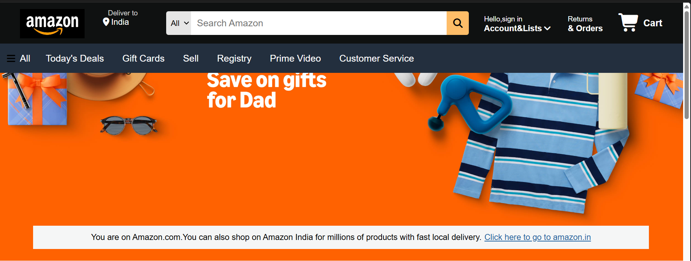
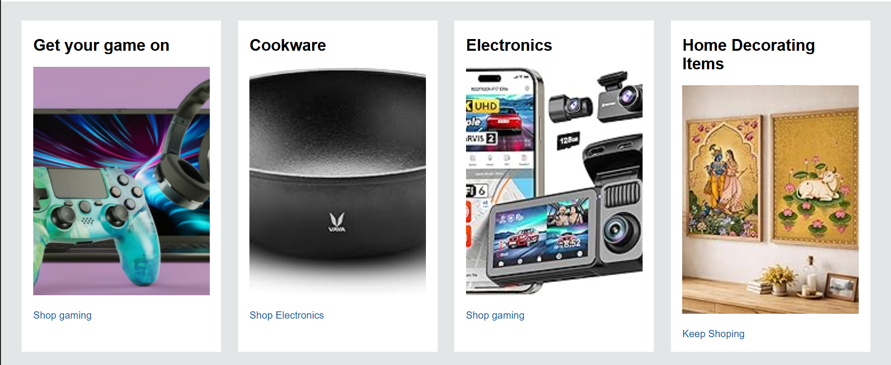
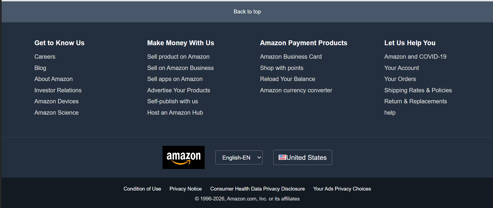

# 🛒 Amazon Clone

A responsive front-end clone of the Amazon homepage built using **HTML5** and **CSS3**. This project recreates the layout and design of Amazon's landing page to practice modern web development concepts and responsive design.

---

## 🚀 Features

- Amazon-inspired homepage layout
- Responsive navigation bar
- Hero banner section
- Product category cards
- Footer similar to Amazon
- Responsive design for different screen sizes
- Clean and organized code structure

---

## 🛠️ Technologies Used

- HTML5
- CSS3

---

## 📂 Project Structure

```
amazon-clone
│── index.html
│── style.css
│── images/
└── README.md
```

---

## ▶️ How to Run the Project

1. Clone or download this repository.
2. Open the project folder.
3. Open `index.html` in your browser.

No installation or additional software is required.

---

## 📸 Screenshots

### Home Page



### Product Section



### Footer



---

## 📌 Learning Outcomes

This project helped me learn:

- HTML page structure
- CSS Flexbox
- CSS Grid
- Responsive Web Design
- Positioning and Layout
- Styling and UI Design

---

## 🔮 Future Improvements

- Add JavaScript for interactivity
- Implement search functionality
- Add shopping cart features
- Connect with a backend database
- Improve mobile responsiveness

---

## 👨‍💻 Author

**Nirav Rana**
